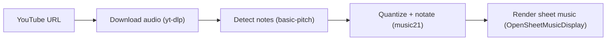
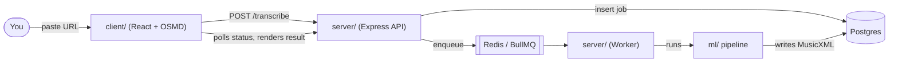

# Sheet Music Generator

Paste a YouTube link to an instrumental performance and get back readable
sheet music. No API keys, no paid services — everything runs locally or on
free tiers.

## What it does



Under the hood, that pipeline runs as a background job so the page stays
responsive while a video transcribes:



The client polls job status and, once a job completes, renders the
resulting MusicXML directly in the browser.

## Project structure

| Folder | What it is |
|---|---|
| [`client/`](client) | React + Vite frontend — paste a URL, watch it transcribe, view the sheet music |
| [`server/`](server) | Express API + BullMQ worker — orchestrates the pipeline, tracks job status in Postgres |
| [`ml/`](ml) | Python scripts — the actual audio-to-notation pipeline (yt-dlp, basic-pitch, music21) |

See [DEPLOY.md](DEPLOY.md) for deploying `client/` to Vercel and `server/`
(with the `ml/` pipeline baked in) to Render.

## Quickstart (run everything locally)

```bash
# 1. Python pipeline — requires Python 3.11 and ffmpeg on PATH
#    (see ml/ below for why)
cd ml
python -m venv .venv
.venv\Scripts\activate        # Windows — or: source .venv/bin/activate
pip install -r requirements.txt
cd ..

# 2. Local Postgres + Redis (isolated to this project — see docker-compose.yml)
docker compose up -d

# 3. Server — two processes: the API and the worker
cd server
npm install
cp .env.example .env
npm run dev      # terminal A — API on http://localhost:3010
npm run worker   # terminal B — picks up transcription jobs

# 4. Client
cd client
npm install
npm run dev      # http://localhost:5173
```

Open `http://localhost:5173`, paste a YouTube URL for a solo instrumental
performance, and watch it move from "queued" through "processing" to
rendered sheet music.

## `ml/`

Requires Python 3.11 (basic-pitch does not yet support 3.13+ on Windows without
pulling in an incompatible TensorFlow version) and `ffmpeg` on your PATH
(used by yt-dlp to extract audio, and needed to decode most YouTube audio
formats). On Windows: `winget install Gyan.FFmpeg`.

```
cd ml
python -m venv .venv
.venv\Scripts\activate       # Windows
# source .venv/bin/activate  # macOS/Linux
pip install -r requirements.txt
```

Three standalone CLI scripts make up the pipeline `server/`'s worker calls;
each is also runnable on its own for testing or debugging:

### transcribe.py

Downloads a YouTube video's audio and runs it through basic-pitch to get raw
note events (no MusicXML yet):

```
python transcribe.py <youtube-url>
```

Prints each note event (pitch, start time, end time, velocity) to the
console and writes the full list as JSON to `ml/output/notes.json`. Use
`--output <path>` to write elsewhere.

`--onset-threshold` / `--frame-threshold` (both basic-pitch defaults: 0.5 /
0.3) control how confident a detection must be to count as a note — raise
either to suppress spurious/false-positive notes on noisy transcriptions.
On a real test video, raising both (0.65 / 0.4) cut note count 22% and
roughly halved implausible-register outliers; see `diagnostics.py` below
for how to check whether a transcription needs this.

### notation.py

Turns `output/notes.json` into a notated, two-staff `music21` Score:

```
python notation.py --tempo 120 --grid 16
```

Quantizes note onsets/durations to the nearest grid unit (`--grid 16` =
sixteenth notes; `--grid 8` = eighth notes, etc.) at the given `--tempo`
(BPM), runs `key.analyze('key')` on the quantized notes to detect a key
signature, splits notes into treble/bass staves at middle C (MIDI 60), and
writes the result as MusicXML to `ml/output/score.musicxml`. Use `--input`
/ `--output` to read/write elsewhere.

### diagnostics.py

Prints summary statistics on `output/notes.json` to help spot noisy
transcription before opening the MusicXML in a notation editor:

```
python diagnostics.py --tempo 120
```

Reports total note count, average note duration, the number of notes
shorter than a 32nd note at the given `--tempo` (likely transcription
noise), and the overall pitch range. Use `--input` to read elsewhere.

## `server/`

```
cd server
npm install
cp .env.example .env   # points at the docker-compose Postgres/Redis by default
npm run dev
npm run worker
```

| Script | Runs |
|---|---|
| `npm run dev` | The API (`src/index.ts`) via `tsx`, watching for changes |
| `npm run worker` | The worker, pulling transcription jobs off the queue |
| `npm run build` | Compiles both to `dist/` |
| `npm start` | The compiled API |
| `npm run start:worker` | The compiled worker |
| `npm test` | The URL-validator unit tests |

The API listens on `http://localhost:3010` by default (override with
`PORT`; chosen to avoid clashing with other local projects that default to
3001). It needs the local Postgres/Redis from `docker compose up -d` (see
[Quickstart](#quickstart-run-everything-locally)) — `.env.example` already
points at those.

- `POST /transcribe` — body `{ "youtubeUrl": string, "instrument": string }`, returns `{ "jobId": string }`.
- `GET /transcribe/:jobId/status` — returns job status, and the MusicXML once `status` is `"completed"`.

Set `RUN_WORKER_INLINE=true` to run the worker in-process alongside the API
instead of as a second process (used for the single-service Render
deployment — see [DEPLOY.md](DEPLOY.md)).

## `client/`

```
cd client
npm install
npm run dev     # starts the Vite dev server
npm run build   # production build to dist/
```

Dev server runs at `http://localhost:5173`.

The page posts a YouTube URL to `POST /transcribe`, polls
`GET /transcribe/:jobId/status`, and renders the returned MusicXML with
[OpenSheetMusicDisplay](https://opensheetmusicdisplay.org/). It talks to the
API at `VITE_API_BASE_URL` (see `.env.example`; defaults to
`http://localhost:3010`).
